> **⚠️ BORRADOR para edición y validación humana.** El contenido analítico, las cifras
> y las figuras provienen de ejecutar el pipeline reproducible (`src/run_all.py`) sobre
> el corte 2023 de los *World Development Indicators*. Falta completar la carátula
> (nombres, fecha) y revisar la redacción final. Todas las afirmaciones cuantitativas
> son trazables a los archivos de `data/processed/`.

---

# Carátula

- **Materia:** Análisis Multivariado y Descubrimiento de Patrones
- **Carrera:** Licenciatura en Ciencia de Datos — Universidad Austral
- **Trabajo:** Práctico Final — Análisis de Componentes Principales (PCA) y Análisis de Conglomerados (*clustering*)
- **Integrantes:** *[completar]*
- **Fecha de entrega:** *[completar]*
- **Conjunto de datos:** *World Development Indicators* (Banco Mundial), corte transversal 2023 con comparación temporal contra 2005.

---

# 1. Introducción

## 1.1 Motivación y pregunta de investigación

El "desarrollo" de un país no es una magnitud que pueda medirse con un único número.
Es un fenómeno multidimensional que combina el nivel de ingreso, la salud de la
población, la urbanización, la conectividad, la estructura productiva y la inserción
comercial, entre otras dimensiones. Cuando se dispone de muchos indicadores
correlacionados entre sí, surge una pregunta natural y a la vez metodológicamente
interesante:

> ¿Cuántas dimensiones *realmente independientes* hacen falta para describir las
> diferencias de desarrollo entre países, y existen *grupos* de países con perfiles
> reconocibles?

Este trabajo aborda esa pregunta con dos técnicas multivariadas complementarias,
aplicadas sobre un panel de catorce indicadores de desarrollo:

1. **Análisis de Componentes Principales (PCA).** Reduce un conjunto de variables
   correlacionadas a unos pocos ejes ortogonales (componentes) que concentran la mayor
   parte de la variabilidad. Su valor aquí es doble: *sintetizar* las dimensiones
   latentes del desarrollo y *interpretarlas* en términos sustantivos.
2. **Análisis de Conglomerados (*clustering*).** Agrupa a los países por similitud para
   descubrir perfiles de desarrollo de manera no supervisada, sin imponer de antemano
   una clasificación.

La elección de PCA —y no de un Análisis de Correspondencias— responde a la naturaleza
**mayormente numérica** de los datos. Las dos variables **categóricas** disponibles
(la *región* y el *nivel de ingreso* del Banco Mundial) se reservan para un rol
**suplementario e ilustrativo**: no intervienen en la construcción de los componentes
ni en el cálculo de las distancias, sino que sirven para **validar e interpretar** los
resultados (por ejemplo, comprobando si los grupos hallados de forma no supervisada
coinciden con la clasificación oficial de ingreso).

A modo de hipótesis de trabajo, cabe esperar que **una primera dimensión domine**
—un "gradiente de desarrollo" que ordene a los países de menor a mayor nivel— pero que
**no agote** la estructura: dimensiones como la composición sectorial de la economía
podrían variar con relativa independencia del nivel de desarrollo. El análisis pondrá a
prueba esta intuición.

## 1.2 Datos

- **Fuente.** *World Development Indicators* (WDI, `source=2`), API pública del Banco
  Mundial. Se descargó un *snapshot* crudo (fechado en `data/raw/manifest.json`) y todo
  el análisis trabaja a partir de él, de modo que los resultados sean **reproducibles**
  aunque la fuente se actualice.
- **Unidad de análisis.** El país, en corte transversal anual. Se descartan las
  **agregaciones** del Banco Mundial (mundo, zona euro, agrupaciones por ingreso, etc.),
  reteniendo únicamente entidades con código ISO-3 válido y región no agregada: **217
  países reales**.
- **Años.** **2023** como corte moderno y **2005** como referencia temprana. La elección
  de ambos años se justifica por cobertura y estabilidad (§1.3).
- **Tamaño.** Aproximadamente 191 países × 2 años, muy por debajo del límite de 10.000
  observaciones de la consigna.
- **Variables.** **14 indicadores numéricos** (la consigna exige ≥ 5) más **2
  categóricas**.

| Dimensión del desarrollo | Indicadores numéricos (WDI) |
|---|---|
| Nivel de ingreso | PBI per cápita (**US$ constantes de 2015**, es decir, en términos **reales**) |
| Coyuntura macroeconómica | Crecimiento anual del PBI, inflación al consumidor, desempleo |
| Inversión e inserción comercial | Formación bruta de capital, exportaciones e importaciones (% del PBI) |
| Estructura productiva | Valor agregado de agricultura, industria y servicios (% del PBI) |
| Desarrollo social | Población urbana (%), esperanza de vida al nacer, uso de Internet (%) |
| Huella ambiental | Emisiones de CO₂ per cápita |

Variables categóricas (suplementarias): **región** y **nivel de ingreso** del Banco
Mundial.

## 1.3 Decisiones de construcción del conjunto de datos

Tres decisiones merecen justificarse aquí porque condicionan todo lo que sigue; el
detalle completo está en `reports/decisiones_metodologicas.md`.

**Elección del año moderno (2023 y no 2021 o 2022).** El PCA y el *clustering* son
sensibles a años con perturbaciones macroeconómicas atípicas, porque tales episodios
distorsionan la estructura de correlaciones. El año 2021 está contaminado por el
**rebote posterior a la pandemia** (crecimientos del PBI anómalamente altos por la
recuperación de la caída de 2020), y 2022 por el **shock inflacionario global y la
guerra en Ucrania**. El año **2023** refleja un entorno ya normalizado y conserva
**cobertura adecuada** en las catorce variables (todas por encima del 78 % de países
con dato). Como evidencia de que la elección importa: con el corte 2021 la carga del
crecimiento del PBI sobre el primer componente cambiaba de signo respecto de 2005, un
artefacto del rebote; con 2023 esa carga es prácticamente nula en ambos años y la
estructura resulta estable (§2.4). El año 2024 se descartó porque la cobertura cae por
debajo del umbral en tres variables.

**Elección del año temprano (2005).** Es el año más temprano (≥ 2000) en el que *todas*
las variables seleccionadas superan el 75 % de cobertura; la variable limitante es la
formación bruta de capital. Tomar 2000 habría forzado una imputación excesiva en el
corte temprano.

**Selección de variables.** De una lista candidata más amplia se **descartaron** tres
indicadores: el índice de Gini (cobertura del 26–40 %, por basarse en encuestas
esporádicas), el gasto público en educación (cobertura inestable e incomparable en el
tiempo) y el INB per cápita PPA (de baja cobertura en 2005 y, además, redundante con el
PBI per cápita, con el que correlaciona en torno a 0,98). El criterio rector fue
privilegiar la **comparabilidad temporal** —usar exactamente el mismo conjunto de
variables en ambos años— y evitar duplicar la dimensión de ingreso.

Tras los filtros de calidad, el conjunto final comprende **192 países en 2005**,
**191 en 2023** y un **panel común de 183** países presentes en ambos cortes (el panel
común es el que habilita el análisis de trayectorias de §2.4).

---

# 2. Desarrollo

## 2.1 Análisis univariado y bivariado

### Distribuciones y decisión de transformaciones

El primer paso, anterior a cualquier modelado, fue **examinar la distribución de cada
variable** (Figura 1) y su asimetría, porque tanto el PCA como el *clustering* por
distancia euclídea son sensibles a la escala y a las colas pesadas. El diagnóstico
reveló tres situaciones cualitativamente distintas:

- Variables **estrictamente positivas y de varios órdenes de magnitud**, con fuerte
  asimetría a derecha: el PBI per cápita (de ~250 a ~110.000 dólares) y las emisiones de
  CO₂ per cápita. Aquí la diferencia relevante entre países es *multiplicativa*, no
  aditiva, lo que justifica una transformación **logarítmica** (logaritmo natural para
  el PBI; `log1p` para el CO₂, que admite valores próximos a cero).
- Variables con **valores negativos** (la inflación puede ser deflación; el crecimiento
  del PBI puede ser contracción), que impiden el logaritmo directo. Para las asimétricas
  de este grupo se usó la transformación **Yeo-Johnson**, que admite negativos y estima
  su parámetro a partir de los datos.
- Variables **acotadas** (participaciones sectoriales, porcentaje urbano, porcentaje de
  usuarios de Internet) con asimetría leve, que **no se transformaron** para no
  introducir distorsiones innecesarias.

El criterio fue **decidir variable por variable** según la asimetría observada, en lugar
de aplicar una regla uniforme. Un caso ilustrativo es el crecimiento del PBI: se dejó
sin transformar porque su asimetría original es leve, tiene valores negativos y está
dominada por *outliers* puntuales (rebotes pospandemia), de modo que Yeo-Johnson no la
mejoraba de forma estable. El orden de operaciones —**primero transformar, después
estandarizar**— es el correcto: la transformación corrige la forma de la distribución y
la estandarización iguala las escalas. Tras transformar, la asimetría queda contenida
por debajo de 0,6 en valor absoluto en casi todas las variables.

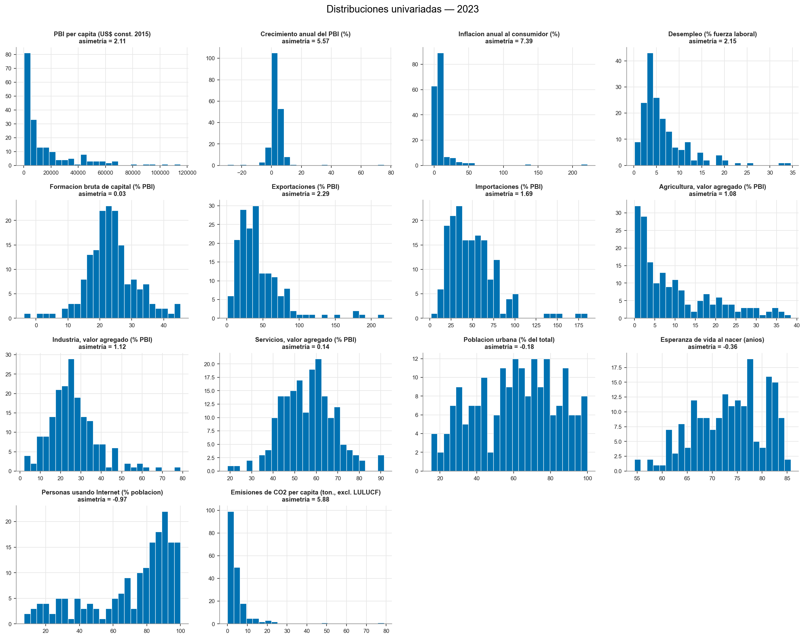

### Estructura de correlaciones

El análisis bivariado (Figura 2) muestra un hallazgo que anticipa toda la sección de
PCA: existe un **bloque de variables fuertemente correlacionadas entre sí** —PBI per
cápita, esperanza de vida, urbanización, uso de Internet y emisiones de CO₂— que se
mueven juntas y se oponen, con signo negativo, al peso de la agricultura en el producto.
Es decir, los países ricos tienden simultáneamente a ser más urbanos, más longevos, más
conectados y menos agrarios. Esta **redundancia informativa** es exactamente lo que el
PCA aprovecha para sintetizar: si muchas variables dicen "lo mismo", basta un eje para
resumirlas. También aparecen correlaciones esperables y de interpretación más acotada,
como la que vincula exportaciones e importaciones (ambas reflejan apertura comercial).

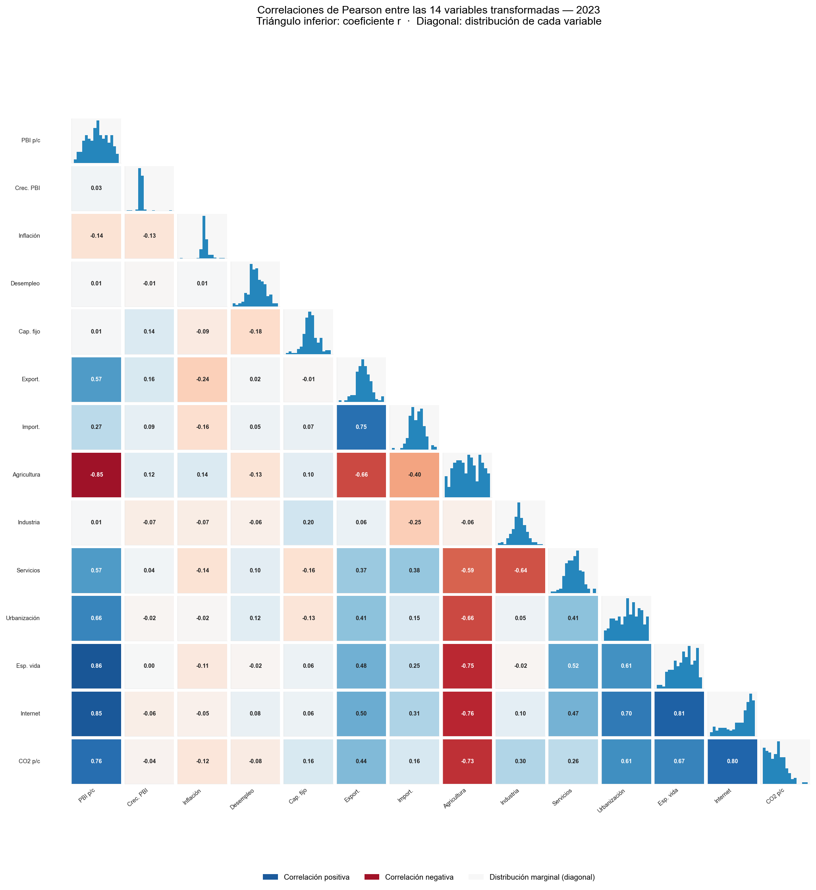

Cuando se cruzan las variables numéricas con la categórica **nivel de ingreso**
(Figura 3), los grupos de ingreso quedan ordenados de manera **monótona**: a mayor
ingreso, mayor esperanza de vida, mayor penetración de Internet y menor peso de la
agricultura. Esta coherencia entre una variable categórica externa y el comportamiento
de las numéricas es una primera señal de que un único eje latente —un gradiente de
desarrollo— estructura buena parte de los datos.

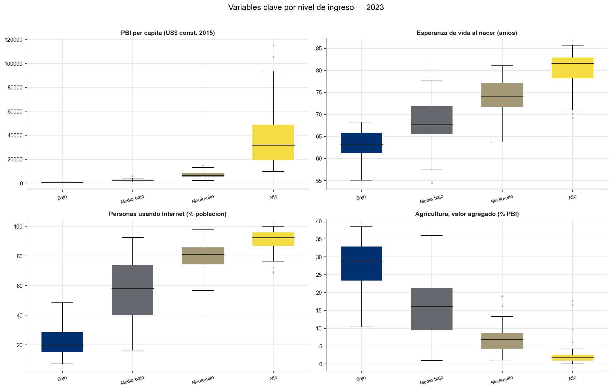

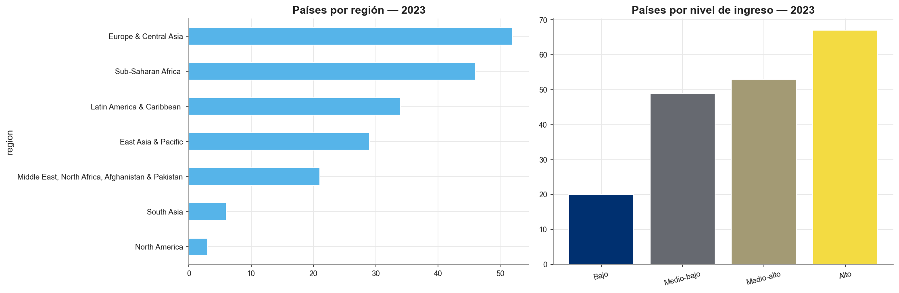

## 2.2 Técnica 1 — Análisis de Componentes Principales

### Supuestos y preparación

El PCA se aplicó sobre la **matriz de correlación**, lo que equivale a trabajar con las
variables **estandarizadas** (media 0, desvío 1). La estandarización es **imprescindible**
porque las variables están en escalas incomparables —dólares, porcentajes, años,
toneladas—: sin ella, el PBI per cápita, por su varianza nominal mucho mayor, dominaría
artificialmente los primeros componentes. Estandarizar pone a todas las variables en pie
de igualdad y obliga al método a "ganarse" la varianza explicada a partir de la
estructura de correlaciones, no de las unidades de medida.

### ¿Cuántos componentes retener?

Decidir cuántos componentes conservar es una de las decisiones más delicadas del PCA, y
deliberadamente **no se basó en un único criterio**. Se contrastaron tres (Figura 5):

- El **criterio de Kaiser** (autovalor > 1) sugiere **4** componentes; es conocido por
  *sobrestimar* y por su arbitrariedad.
- El umbral de **80 % de varianza acumulada** llevaría a **6** componentes; el umbral
  mismo es convencional.
- El **análisis paralelo de Horn** —considerado el estándar de referencia— retiene
  **3** componentes. Este método compara cada autovalor observado contra la distribución
  de autovalores que produciría una matriz de datos *aleatorios* de las mismas
  dimensiones (se simularon 1.000 matrices y se tomó el percentil 95): solo se conservan
  los componentes que superan ese "ruido".

Los tres criterios **convergen en torno a 3–4** componentes. Se adoptan **3** para la
interpretación, que acumulan el **64,9 %** de la varianza total. Conviene subrayar una
distinción que suele confundirse: estos tres componentes son los que se usan para
*interpretar* y, eventualmente, como espacio de comparación para el *clustering*;
para *visualizar* en un plano basta con dos. Nunca se mezclan ambos usos.

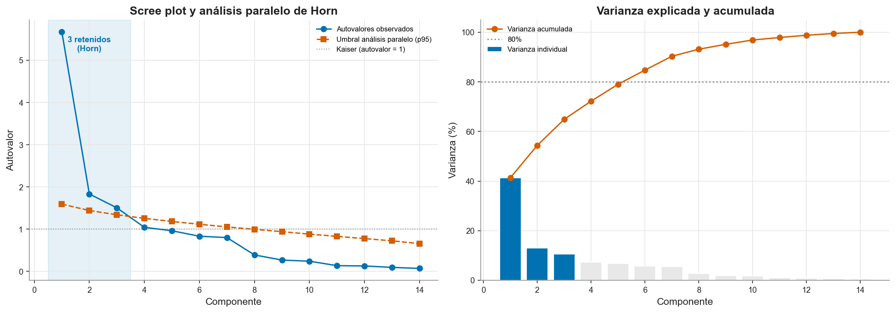

### Interpretación de los ejes (en términos del problema)

Las cargas se leen como **correlaciones entre cada variable y cada componente**, lo que
permite nombrar los ejes de forma sustantiva:

- **PC1 (41,3 % de la varianza) — gradiente de desarrollo.** Carga positivamente y con
  fuerza sobre el PBI per cápita (0,93), el uso de Internet (0,90), la esperanza de vida
  (0,87) y las emisiones de CO₂ per cápita (0,81), y negativamente sobre el peso de la
  agricultura (−0,92). Es el eje que ordena a los países desde un perfil "agrario, de
  menor ingreso y menor conectividad" hacia uno "rico, urbano, longevo y conectado".
  Que un solo componente concentre el 41 % de la variabilidad de catorce indicadores
  confirma que el desarrollo tiene **una dimensión dominante**; que no llegue al 100 %
  recuerda que **no es unidimensional**.
- **PC2 (13,1 %) — estructura productiva.** Opone la industria y la formación de capital
  (cargas positivas) a los servicios y el desempleo (cargas negativas). Es un eje de
  *composición* de la economía, y su aspecto más interesante es que resulta
  **ortogonal** al PC1: la mezcla industria-servicios de un país es en buena medida
  **independiente de su nivel de desarrollo**. Hay economías muy desarrolladas y
  fuertemente industriales (estados petroleros del Golfo) y otras igualmente
  desarrolladas pero terciarizadas (centros de servicios), y el PC2 las separa sin
  contradecir su posición común en el PC1.
- **PC3 (10,5 %) — apertura comercial y estabilidad macroeconómica.** Combina
  exportaciones e importaciones (positivas) frente a la inflación (negativa); distingue
  economías abiertas y de precios estables de economías más cerradas o inflacionarias.

El **círculo de correlaciones** (Figura 6) y el **biplot** coloreado por nivel de
ingreso (Figura 7) confirman visualmente la lectura: el PC1 separa con nitidez los
niveles de ingreso del Banco Mundial, lo que **valida el primer eje contra una
clasificación externa** que no participó de su construcción. La longitud de los vectores
en el círculo informa, además, qué variables están bien representadas en el plano
PC1–PC2 (las de vector largo) y cuáles requieren del PC3 para interpretarse.

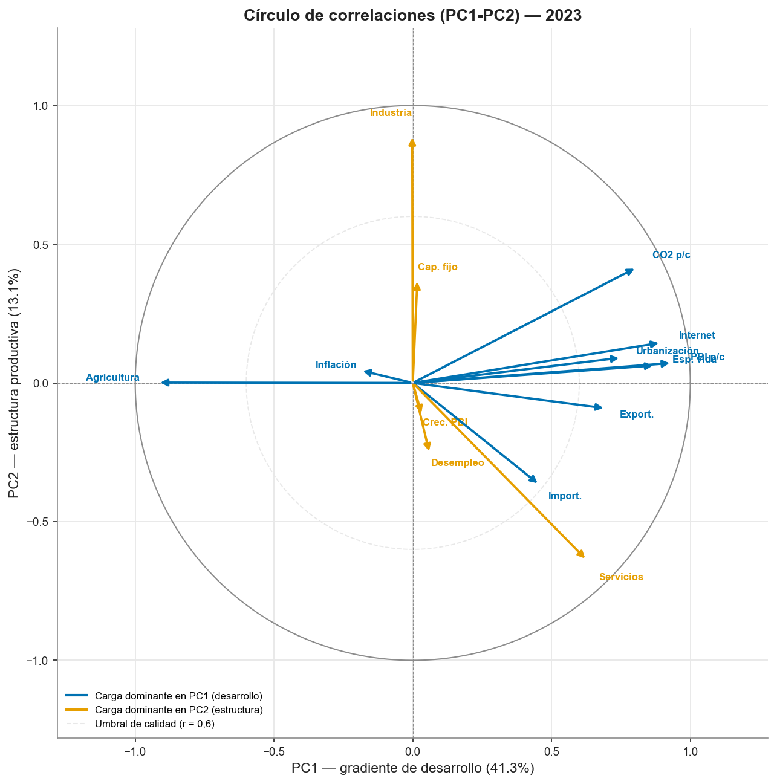

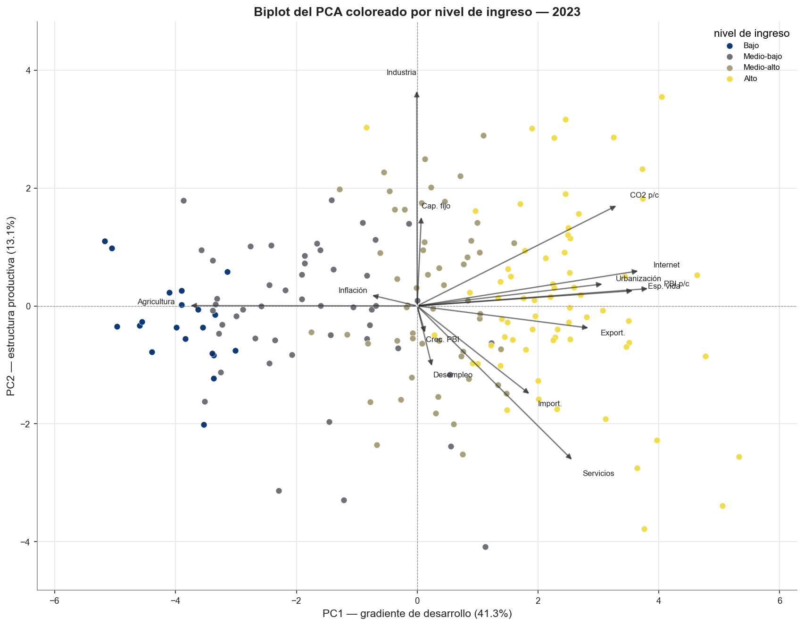

## 2.3 Técnica 2 — Análisis de Conglomerados

### Una decisión metodológica central: ¿agrupar sobre las variables o sobre los componentes?

Existe la tentación de reducir primero con PCA y agrupar después sobre unos pocos
componentes (lo que se conoce como *tandem analysis*). Es una práctica **riesgosa**:
el PCA maximiza varianza, no separación entre grupos, de modo que la estructura de
conglomerados podría residir en componentes de baja varianza que se descartarían. Con
solo catorce variables **no estamos en alta dimensión**, por lo que la decisión adoptada
fue:

- **agrupar sobre las catorce variables completas** (transformadas y estandarizadas)
  como análisis **principal**; y
- **agrupar también sobre los tres componentes de Horn** y **medir el acuerdo** entre
  ambas particiones mediante el índice de Rand ajustado (ARI).

El resultado es contundente: el ARI entre la partición sobre 14 variables y la partición
sobre 3 componentes es **1,00** para *k* = 2, es decir, **idénticas**. La conclusión es
matizada y honesta: aquí la estructura de grupos *sí* vive en los componentes de alta
varianza, por lo que el *tandem* no introduce sesgo —pero esto se **demostró** en lugar
de suponerlo. (El coeficiente de silueta sube de 0,28 sobre las 14 variables a 0,40
sobre los 3 componentes: el PCA "limpia" el ruido de las dimensiones de baja varianza y
la separación *se ve* mejor, aunque la partición subyacente sea la misma.)

### Algoritmos, número de conglomerados y estabilidad

Se emplearon **dos algoritmos** —*k*-means y el método jerárquico de Ward— y el número
de grupos se decidió por **consenso de varios criterios** (Figura 8) más una prueba de
**estabilidad por remuestreo** (criterio de Hennig):

| Criterio | Indica |
|---|---|
| Silueta, Calinski-Harabasz y Davies-Bouldin | *k* = 2 |
| Estadístico *gap* | *k* = 2 |
| Estabilidad bootstrap (Jaccard) | *k* = 2: 0,96 / 0,94 (muy estable); *k* = 3: 0,73–0,88; *k* = 4: se disuelve (0,27) |
| Acuerdo entre algoritmos (ARI *k*-means vs. Ward) | 0,62 (*k* = 2); 0,75 (*k* = 3) |

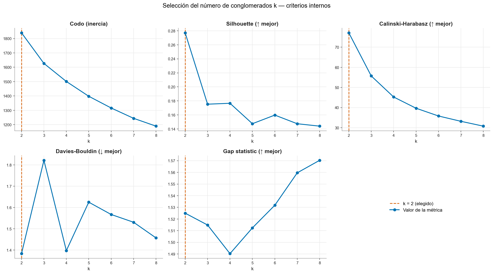

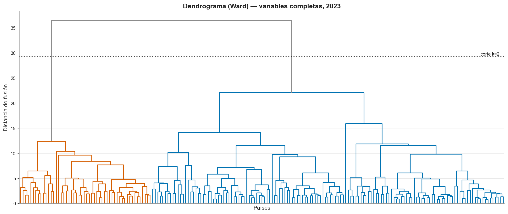

La convergencia es clara hacia **dos conglomerados como partición principal**: es la
solución mejor respaldada por las métricas internas y de una estabilidad muy alta
(las dos celdas de Jaccard por encima de 0,94). Conviene ser transparente sobre un punto:
el acuerdo entre *k*-means y Ward para *k* = 2 (0,62) es *menor* que para *k* = 3 (0,75).
Lejos de ser una contradicción, esto es coherente con la naturaleza **continua** del
fenómeno (ver más abajo): cuando el desarrollo es un gradiente sin cortes naturales, la
*ubicación exacta* de la frontera binaria depende algo del algoritmo, aunque la
separación gruesa "desarrollado / en desarrollo" sea robusta. Se reporta además
**k = 3 como vista complementaria**, que desagrega un gradiente de tres niveles
(bajo desarrollo, emergente, desarrollado) y resulta también estable.

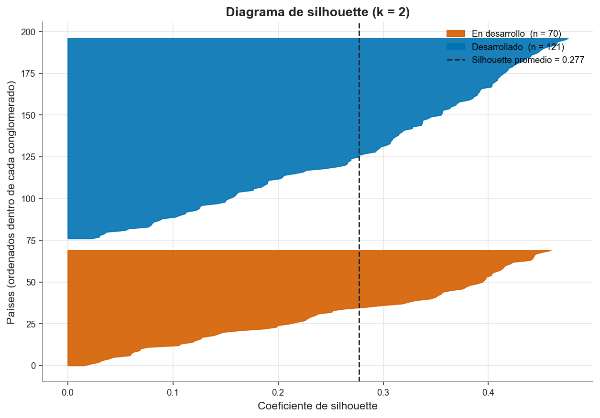

### Supuestos de *k*-means y validación con métodos alternativos

*k*-means presupone conglomerados aproximadamente esféricos y de tamaño similar. Para
poner a prueba ese supuesto se ensayaron dos alternativas. Un **modelo de mezclas
gaussianas** (que admite grupos elípticos) coincide solo de forma moderada con *k*-means
(ARI 0,62). Y, más revelador, **HDBSCAN** —que agrupa por densidad y puede declarar
"ruido"— clasifica a cerca del **59 % de los países como ruido** y reconoce apenas dos
núcleos densos. Esto constituye la **evidencia más honesta** del trabajo: el desarrollo
es un **continuo** (el gradiente del PC1) y no un conjunto de grumos densos y
naturalmente separados. La consecuencia interpretativa es importante: el *clustering*
ofrece una **macro-separación útil**, no una taxonomía fina de países. Por eso el
coeficiente de silueta es moderado, y por eso evitamos vender los grupos como una
tipología cerrada.

### Perfil de los conglomerados (*k* = 2)

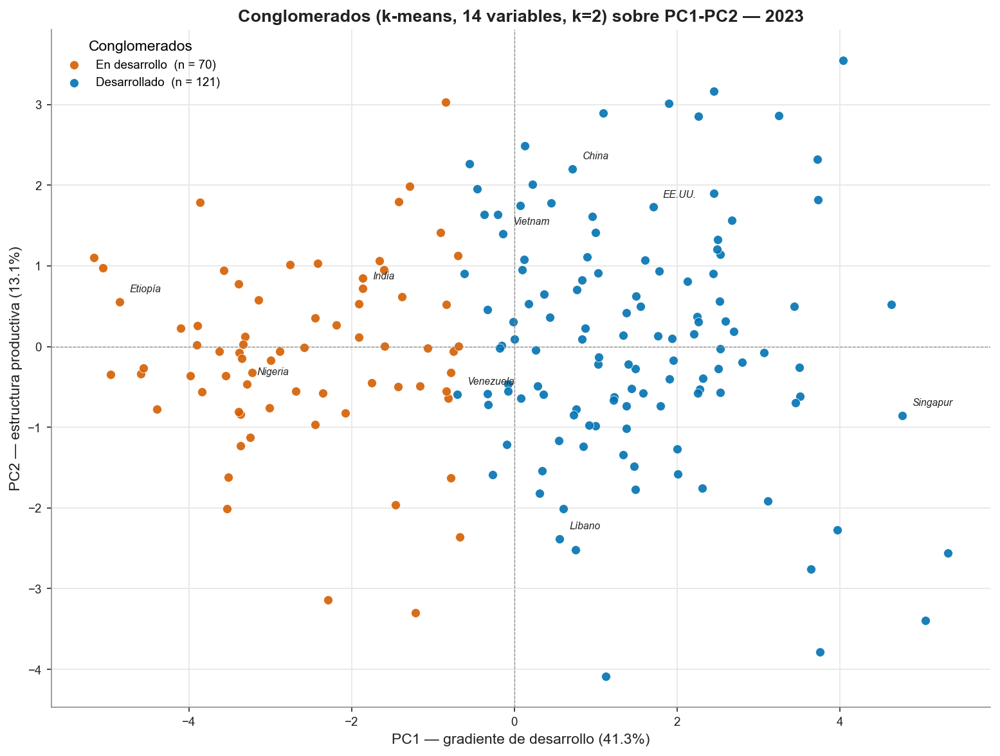

La descripción de cada grupo por las **medianas** de las variables originales (más
interpretables que las estandarizadas) confirma una lectura nítida en términos del
problema:

| Variable (mediana) | Grupo 0 — *en desarrollo* (70 países) | Grupo 1 — *desarrollado* (121 países) |
|---|---:|---:|
| PBI per cápita (US$ 2015) | 1.439 | 14.933 |
| Esperanza de vida (años) | 66,9 | 77,7 |
| Población urbana (%) | 41,2 | 74,0 |
| Uso de Internet (%) | 42,2 | 87,1 |
| Agricultura (% del PBI) | 19,2 | 3,0 |
| Emisiones de CO₂ per cápita (t) | 0,5 | 4,4 |
| Exportaciones (% del PBI) | 22,7 | 44,9 |

El **grupo 0** reúne economías de menor ingreso, más agrarias, menos urbanizadas y
conectadas; el **grupo 1**, economías de mayor ingreso, urbanas, terciarizadas y más
integradas al comercio. La brecha es de un orden de magnitud en PBI per cápita (más de
diez veces) y de más de diez años en esperanza de vida.

### Validación e interpretación con las variables categóricas

El cruce de los conglomerados con el **nivel de ingreso** oficial arroja una asociación
fortísima: χ² = 135,8 (*p* ≈ 2 × 10⁻²⁸) para *k* = 2 y χ² = 228,9 (*p* ≈ 5 × 10⁻⁴⁵) para
*k* = 3. Es decir, los grupos hallados **de forma no supervisada** —solo a partir de la
similitud en catorce indicadores— **reconstruyen** en lo esencial la clasificación de
ingreso del Banco Mundial. Pero lo más informativo no es la coincidencia, sino las
**excepciones**, porque señalan países cuyo *perfil estructural* difiere de lo que
sugeriría su ingreso:

- *Ingreso medio-alto pero perfil "en desarrollo"* (caen en el grupo 0): Indonesia,
  Guatemala, Fiji y varias islas del Pacífico (Marshall, Tonga, Samoa). Son economías
  más agrarias y menos urbanizadas de lo que su nivel de ingreso anticiparía.
- *Ingreso medio-bajo pero perfil "desarrollado"* (caen en el grupo 1): Vietnam,
  Marruecos, Túnez, Jordania y Líbano. Son economías más urbanizadas, conectadas y
  terciarizadas que sus pares de ingreso —"rinden por encima" de su categoría en las
  dimensiones estructurales del desarrollo.

Estas excepciones ilustran el valor de un enfoque multivariado por sobre una simple
ordenación por ingreso: dos países con el mismo PBI per cápita pueden ocupar lugares
distintos en el espacio del desarrollo según su urbanización, conectividad y estructura
productiva.

## 2.4 Comparación temporal 2005 vs 2023

### El problema de comparar a través del tiempo: la tendencia secular

Comparar dos cortes temporales exige cuidado. Ajustamos **un solo** PCA sobre los dos
años apilados (transformaciones y escala decididas sobre la distribución combinada;
imputación siempre *dentro de cada año*), de modo que el **eje de desarrollo esté
definido de forma idéntica** en ambos cortes. Esto permite comparar la **estructura**.
Sin embargo, comparar las **posiciones absolutas** de los países entre años sobre este
eje **no es válido**, y la razón es importante:

> Varias de las variables que definen el PC1 tienen una **fuerte tendencia secular
> global**. El caso extremo es el uso de Internet, cuya mediana pasó de **10 % (2005) a
> 81 % (2023)**; también subió la esperanza de vida (71 → 74 años). En el espacio común,
> esto desplaza a **todos** los países hacia la derecha del PC1 (su media pasa de −0,47
> en 2005 a +0,47 en 2023). Ese corrimiento refleja la **difusión tecnológica y
> sanitaria mundial**, no que los países hayan mejorado *unos respecto de otros*.

La descomposición lo confirma (Figura 14): el corrimiento absoluto medio del PC1 está
**dominado por Internet (47 %) y la esperanza de vida (22 %)**; el PBI per cápita —que,
aclaremos, está en **dólares constantes de 2015**, es decir, es **real** y no nominal—
aporta apenas el 9 %. Es decir, el "avance" absoluto es en gran medida una **marea
creciente** secular, y tomarlo como medida de desarrollo *relativo* sobreestimaría el
progreso (haría aparecer, por ejemplo, a 2005 como mucho menos desarrollado de lo que
era simplemente porque Internet aún no se había difundido).

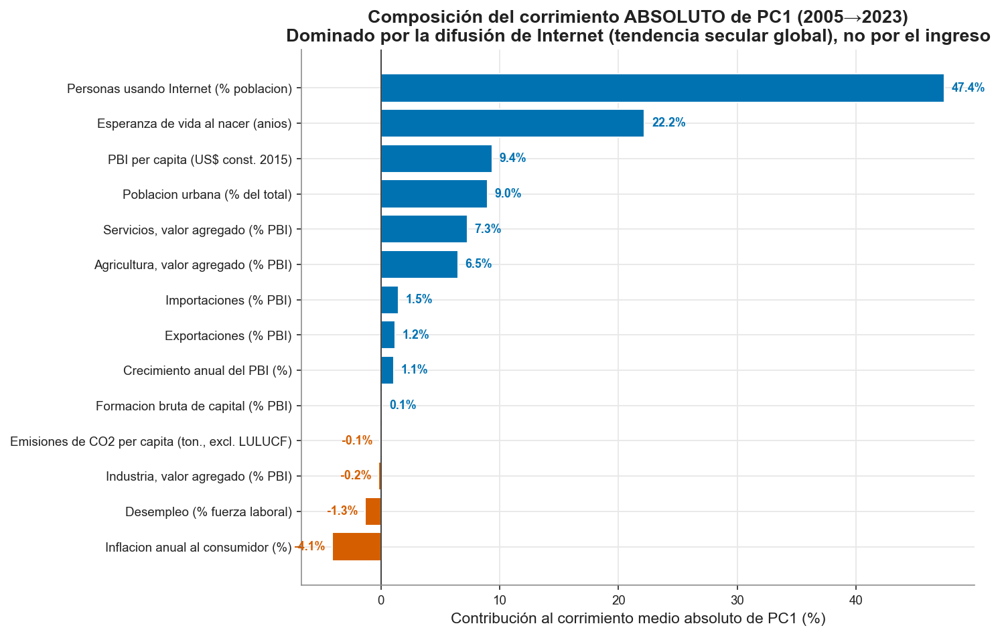

### La comparación válida: posición RELATIVA dentro de cada año

Para neutralizar la tendencia secular comparamos la **posición relativa** de cada país
*respecto de sus contemporáneos*, de dos maneras complementarias:

1. **Tiers relativos:** se clasifica cada año por separado en "desarrollado / en
   desarrollo" (k-means dentro del año). Así, "desarrollado en 2005" significa estar en
   el grupo alto **entre los países de 2005**. El resultado corrige la lectura ingenua:
   ya había **107 de 192 países en el tier desarrollado en 2005** (entre ellos, como es
   esperable, EE.UU., Alemania, Japón, Francia, Corea, etc.), y **121 de 191 en 2023**.
   La proporción de "desarrollados" sube de forma **moderada** (≈56 % → ≈63 %), muy lejos
   del "casi todos avanzaron" que sugería la lectura absoluta.
2. **Percentil de desarrollo dentro del año:** se rankea el PC1 (eje común) dentro de
   cada año. El cambio de percentil mide si un país **ganó o perdió terreno frente a sus
   pares** (Figura 12). Sobre la diagonal no hay cambio relativo; por encima, ascenso
   (catch-up); por debajo, descenso.

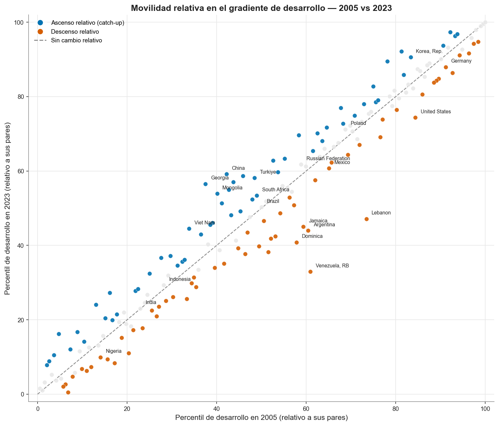

**Movilidad relativa (Figura 13).** En el panel común, **15 países ascendieron** del
tier en desarrollo al desarrollado —catch-up genuino: China, Vietnam, Georgia, Albania,
Azerbaiyán, Botsuana, Marruecos, entre otros— y **solo 1 descendió** (Islas Marshall).
Los mayores ascensos *relativos* en percentil son **Georgia (+19), China (+17), Mongolia
(+14)**; los mayores descensos, exactamente los países en crisis: **Venezuela (−28),
Líbano (−26), Argentina (−16)**. Nótese que los países desarrollados de larga data
(EE.UU., Alemania, Corea) aparecen en el **percentil más alto en *ambos* años**: no es
que "no hubiera desarrollados en 2005", sino que ya lo eran.

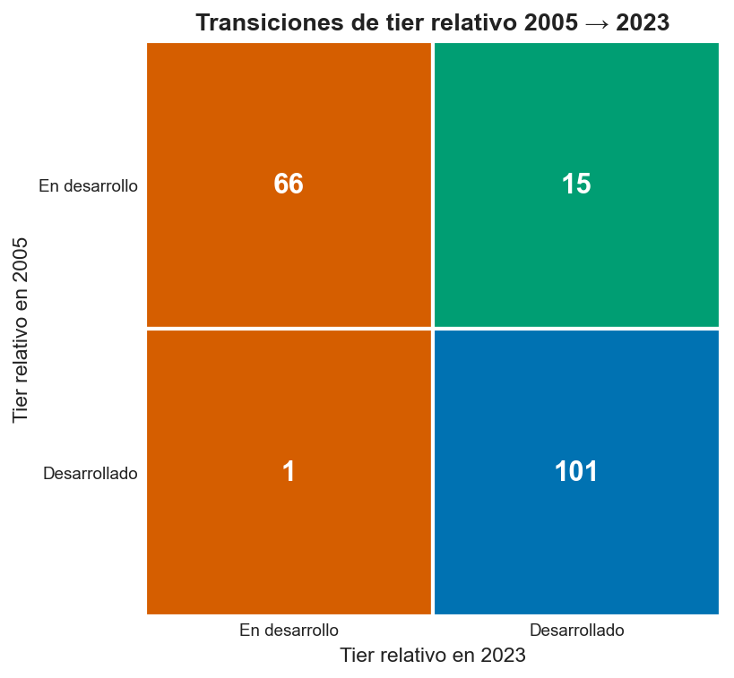

### Estabilidad de la estructura

¿Cambió el *significado* del desarrollo en estas casi dos décadas? No: la **congruencia
de Tucker** entre las cargas del PC1 de 2005 y de 2023 es **0,962** (correlación 0,946),
de modo que el gradiente de desarrollo es prácticamente el **mismo eje** (Figura 15). La
agricultura sigue siendo el marcador más estable de menor desarrollo y las exportaciones
e importaciones ganaron algo de peso. A diferencia del corte 2021, con 2023 el
crecimiento del PBI ya **no** distorsiona el PC1, lo que confirma el beneficio de elegir
un año macroeconómicamente estable. En síntesis: la **estructura** del desarrollo se
mantuvo estable, y la **movilidad relativa** —no el corrimiento secular absoluto— es la
medida válida del cambio.

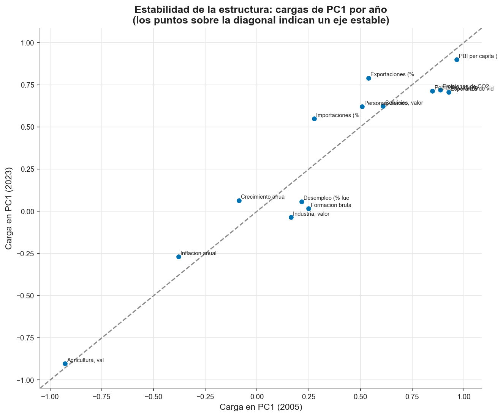

## 2.5 Análisis de sensibilidad

Para que las conclusiones sean creíbles, se verificó su **robustez** ante decisiones
metodológicas alternativas, comparando cada variante contra la configuración base
(estandarización estándar, imputación KNN, 14 variables, *k* = 2) mediante el ARI de la
partición y la correlación de las cargas del PC1:

| Variante | ARI vs. base | Corr. cargas PC1 |
|---|---:|---:|
| Imputación MICE | 0,958 | 1,000 |
| Casos completos (sin imputar) | 1,000 | 0,996 |
| *Clustering* sobre 2 / 3 / 5 componentes | 0,94 / 1,00 / 1,00 | 1,000 |
| Sin 10 *outliers* | 0,934 | 0,982 |
| **RobustScaler (todos los países)** | **−0,004** | **0,009** |
| RobustScaler (sin Macao) | 0,743 | 0,925 |

Ni el método de imputación, ni el número de componentes, ni la mayoría de los *outliers*
alteran las conclusiones. El único quiebre es el escalado **robusto**, y resulta
**instructivo** en lugar de preocupante: `RobustScaler` escala por el rango intercuartílico
pero **no acota las colas**, de modo que el crecimiento del PBI de **Macao en 2023
(+75 %, por el rebote turístico pospandemia)**, al dividirse por un rango intercuartílico
pequeño, adquiere una magnitud enorme y **secuestra el primer componente**, que pasa a
ser un eje de "crecimiento". Al remover únicamente a Macao, el resultado se recompone
(ARI 0,74; correlación de cargas 0,93). La moraleja es que, ante variables de colas
pesadas sin transformar, `StandardScaler` —cuyo desvío, inflado por los propios
*outliers*, los atenúa— es preferible: el episodio **respalda** la elección por defecto
del trabajo.

---

# 3. Conclusiones

1. **El desarrollo tiene una dimensión dominante pero no es unidimensional.** Un único
   eje (PC1) concentra el 41 % de la variabilidad de catorce indicadores y se interpreta
   como un **gradiente de desarrollo** (ingreso, salud, urbanización y conectividad
   frente al peso agrario); pero hacen falta tres componentes para alcanzar ~65 %, donde
   el segundo capta la **estructura productiva** (industria vs. servicios) y el tercero la
   **apertura comercial y la estabilidad macroeconómica**, ambos en buena medida
   independientes del nivel de desarrollo.
2. **Los países se organizan en una macro-separación de dos grupos** —desarrollado y en
   desarrollo— robusta, estable y fuertemente alineada con la clasificación de ingreso
   del Banco Mundial, aunque con excepciones reveladoras (países que "rinden por encima"
   o "por debajo" de su ingreso en las dimensiones estructurales). No se trata de una
   taxonomía fina: la evidencia (silueta moderada, HDBSCAN reconociendo un continuo)
   indica que el desarrollo es esencialmente un **gradiente**.
3. **Entre 2005 y 2023, el "avance" absoluto es en gran medida una tendencia secular, no
   desarrollo relativo.** El corrimiento del PC1 está dominado por la difusión mundial de
   Internet (47 %) y la esperanza de vida (22 %), por lo que comparar posiciones absolutas
   entre años sobreestima el progreso. La medida **válida es la posición relativa dentro
   de cada año**: ya había 107/192 países en el tier desarrollado en 2005 y 121/191 en
   2023; en movilidad relativa, **15 países hicieron catch-up** (China, Vietnam, Georgia…)
   y **solo 1 retrocedió de tier** (Islas Marshall), mientras que Venezuela, Líbano y
   Argentina caen marcadamente en su percentil. La **estructura** del desarrollo
   permaneció estable (congruencia del PC1 = 0,96).
4. **En lo metodológico**, agrupar sobre las variables completas y *comparar* contra los
   componentes evita el sesgo del *tandem analysis*; aquí ambas particiones coinciden
   (ARI 1,00), pero la coincidencia se **demostró** en vez de suponerse.

## Limitaciones

- El análisis es **transversal**: describe asociaciones y posiciones, no relaciones
  causales.
- El *clustering* es una **macro-separación**, no una tipología fina; así se reporta
  explícitamente.
- El "avance" temporal **absoluto** está confundido por la **tendencia secular** de
  variables como Internet (mediana 10 % → 81 %); por eso **no** se usa para medir
  desarrollo y se privilegia la posición **relativa** dentro de cada año (tiers y
  percentiles), robusta a esa tendencia.
- La imputación (faltantes ≤ 15 %) y los *outliers* no alteran las conclusiones, con la
  salvedad documentada de la interacción entre `RobustScaler` y el caso de Macao.
- Los WDI sufren rezagos y revisiones, y algunos indicadores cambian de definición (por
  ejemplo, la serie de CO₂): por ello se fija y documenta un *snapshot* fechado.

---

# Apéndice

- **A1.** Cobertura por variable y año (`data/processed/cobertura_por_anio.csv`).
- **A2.** Asimetría antes y después de transformar (`skewness_antes_despues.csv`).
- **A3.** Autovalores y cargas completas del PCA (`pca_autovalores_2023.csv`,
  `pca_loadings_2023.csv`).
- **A4.** Métricas de selección de *k*, estabilidad y perfilado completo
  (`clustering_resultados_2023.json`, `perfil_medianas_k*_2023.csv`).
- **A5.** Trayectorias, transiciones y descomposición del avance
  (`trayectorias.csv`, `transiciones_cluster.csv`, `descomposicion_dPC1.csv`).
- **A6.** Tabla de sensibilidad (`sensibilidad.csv`).
- **A7.** Registro completo de decisiones metodológicas
  (`reports/decisiones_metodologicas.md`).
- **A8.** Visualizaciones complementarias en `reports/figures/`: cargas de PC1–PC3 en
  barras (`pca_loadings_barras_2023.png`) y dos vistas alternativas de las transiciones
  de grupo —diagrama de flujo *Sankey* (`compare_transicion_sankey.png`) y gráfico
  *waffle* (`compare_transicion_waffle.png`)— que pueden reemplazar o acompañar a las
  figuras del cuerpo según el formato de la entrega.
